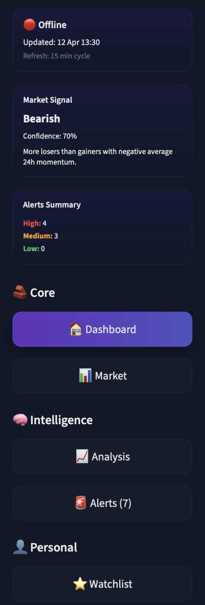
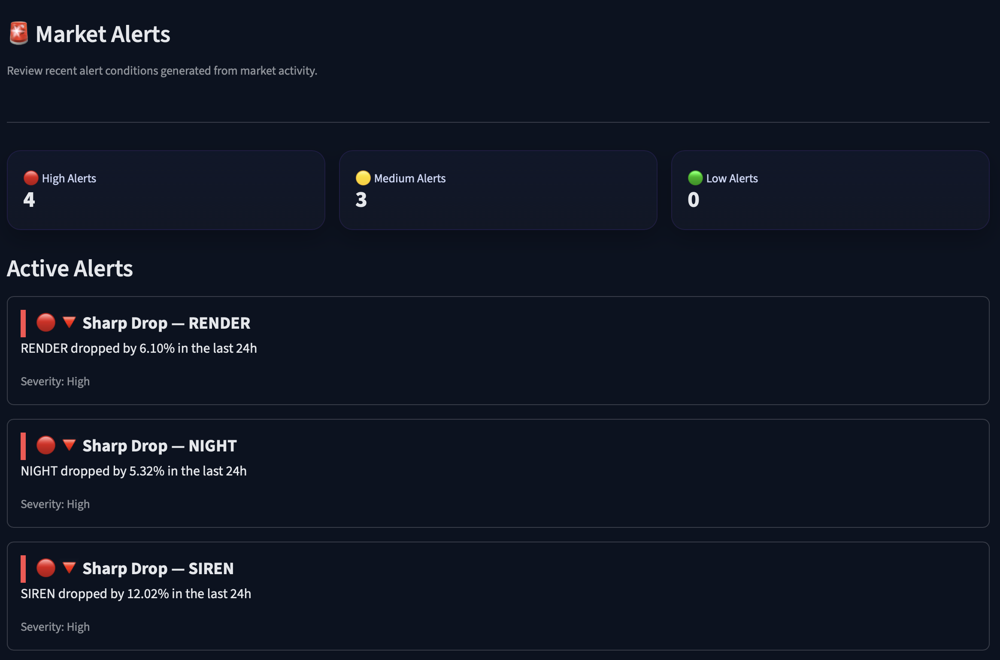
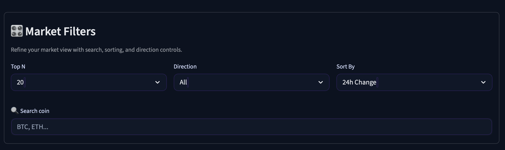
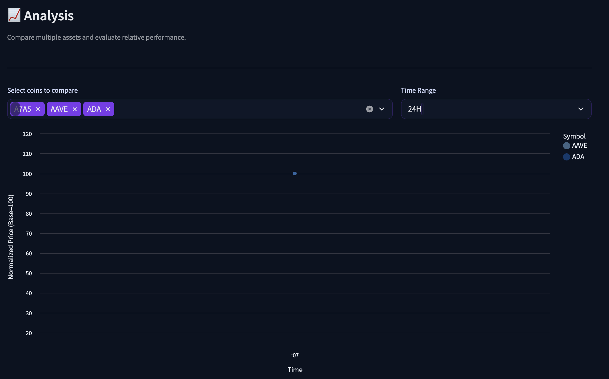
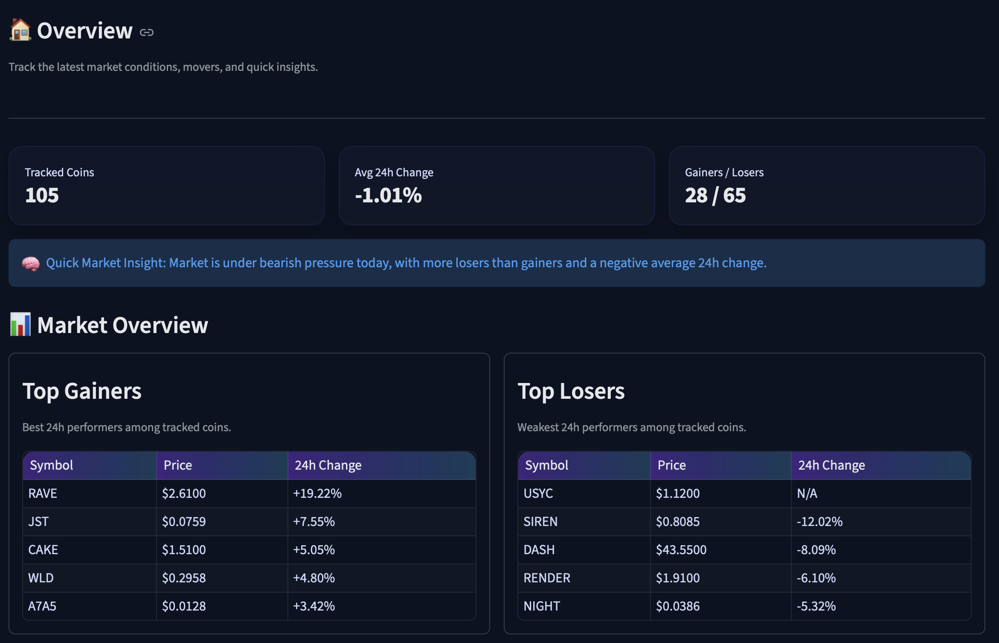

📈 Crypto Analytics Platform

A production-ready end-to-end cryptocurrency data pipeline and analytics dashboard built with Python, MySQL, and Streamlit.

This system continuously collects live market data, processes it into structured insights, and delivers a real-time interactive dashboard with alert detection and performance analytics.

⸻⸻⸻⸻⸻⸻

🌐 Live Demo

👉 https://crypto-data-pipeline-production.up.railway.app

⸻⸻⸻⸻⸻⸻

🚀 Features

🔄 Data Pipeline
	•	Fetches real-time market data from CoinGecko API
	•	Stores structured data in cloud-hosted MySQL (Railway)
	•	Maintains normalized tables:
	•	coins
	•	latest_prices
	•	price_history
	•	price_history_archive
	•	Optimized insert/update logic to prevent duplicates and ensure consistency

⸻⸻⸻⸻⸻⸻

⚙️ Automation & Reliability
	•	Fully automated via Railway Cron Jobs
	•	Runs every 15 minutes
	•	Continuous background ingestion
	•	Logging system for monitoring pipeline activity
	•	Error tracking for production stability

⸻⸻⸻⸻⸻⸻

📊 Analytics Engine
	•	Top gainers / losers (24h)
	•	Highest volume assets
	•	Short-term price movement detection
	•	Historical price tracking
	•	Multi-asset performance comparison

⸻⸻⸻⸻⸻⸻

📊 Interactive Dashboard (Streamlit)
	•	Fully cloud-hosted UI
	•	Auto-refresh every 2 minutes
	•	Advanced filtering & search
	•	Clean, formatted data tables
	•	Interactive charts (Altair)
	•	Real-time system status indicator

⸻⸻⸻⸻⸻⸻

🧠 Advanced Analysis
	•	Multi-coin comparison in a single chart
	•	Normalized performance (Base = 100)
	•	Best / worst performer detection
	•	Ranked performance summaries

⸻⸻⸻⸻⸻⸻

🚨 Alert System

Detects significant market events and transforms raw data into actionable insights:
	•	🚀 Strong Increase → 24h change ≥ +5%
	•	🔻 Sharp Drop → 24h change ≤ -5%
	•	⚡ Rapid Movement → short-term change ≥ 2%

This shifts the system from data visualization → decision support tool.

⸻⸻⸻⸻⸻⸻

```
🧱 Architecture

CoinGecko API
    ↓
Python Data Pipeline (Worker)
    ↓
MySQL Database (Railway)
    ↓
Analytics Layer
    ↓
Streamlit Dashboard (Web App)
```

⸻⸻⸻⸻⸻⸻

🛠 Tech Stack
	•	Python
	•	MySQL
	•	Streamlit
	•	Pandas
	•	Altair
	•	CoinGecko API
	•	Railway (Cloud Deployment & Cron Jobs)

⸻⸻⸻⸻⸻⸻

```
📂 Project Structure

crypto-data-pipeline/
├── src/
│   ├── main.py              # Pipeline runner (worker)
│   ├── fetch_data.py        # API data fetching
│   ├── insert_data.py       # DB insert/update logic
│   ├── archive_data.py      # Archiving old records
│   ├── db.py                # Database connection
│   ├── analytics.py         # Analytics & alerts
│   ├── app.py               # Streamlit dashboard
│   └── logger_config.py     # Logging config

├── sql/
│   └── schema.sql           # Database schema

├── assets/                  # Screenshots
├── requirements.txt
├── README.md
└── .gitignore
```

⸻⸻⸻⸻⸻⸻⸻

▶️ How to Run (Local)

1. git clone https://github.com/AlperTuncOrtak/crypto-data-pipeline.git
cd crypto-data-pipeline

2. python3 -m venv .venv
source .venv/bin/activate

3. pip install -r requirements.txt

4. streamlit run src/app.py

⸻⸻⸻⸻⸻⸻⸻

📸 Screenshots

### Sidebar Navigation & Intelligence Panel


### Alerts System


### Search & Filter


### Multi-Coin Comparison


### Dashboard Overview


⸻⸻⸻⸻⸻⸻⸻

🧠 What This Project Demonstrates
	•	Building an end-to-end data pipeline (API → DB → Dashboard)
	•	Designing efficient time-series database structures
	•	Implementing real-time analytics systems
	•	Creating interactive data dashboards
	•	Deploying full-stack systems to the cloud
	•	Working with scheduled background jobs (cron)
	•	Writing production-ready, modular Python code

⸻⸻⸻⸻⸻⸻⸻

🔮 Future Improvements
	•	Discord / Telegram alert integration
	•	User-defined alert thresholds
	•	Advanced anomaly detection (ML-based)
	•	Export features (CSV / reports)
	•	Query optimization & caching improvements
	•	Persistent user preferences (watchlist storage)

⸻⸻⸻⸻⸻⸻⸻

👤 Author

Alper Tunc Ortak
🔗 https://github.com/AlperTuncOrtak

⸻⸻⸻⸻⸻⸻⸻

⭐ Notes

This project was built as a portfolio piece to demonstrate real-world skills in:
	•	Data Engineering
	•	Backend Systems
	•	Analytics
	•	Cloud Deployment

