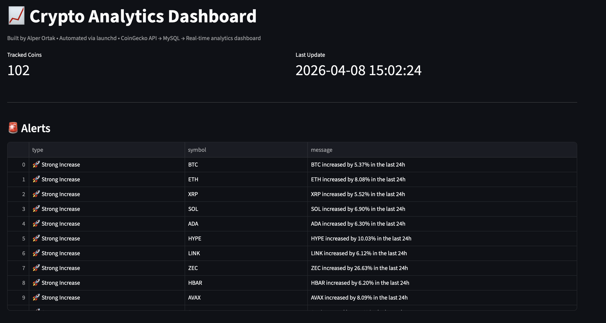
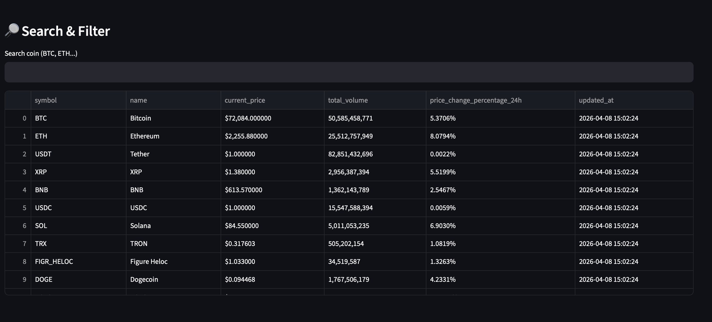
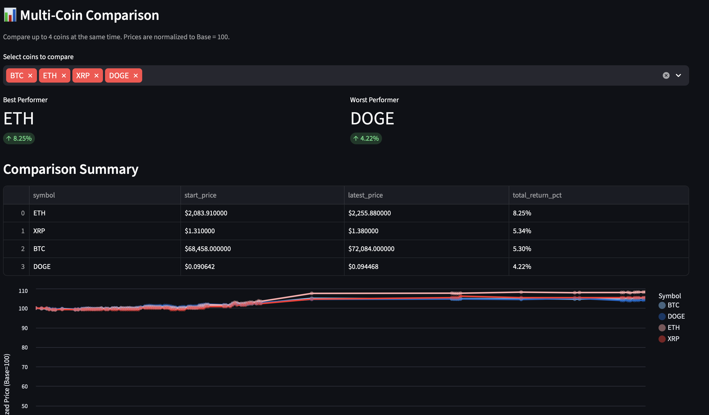
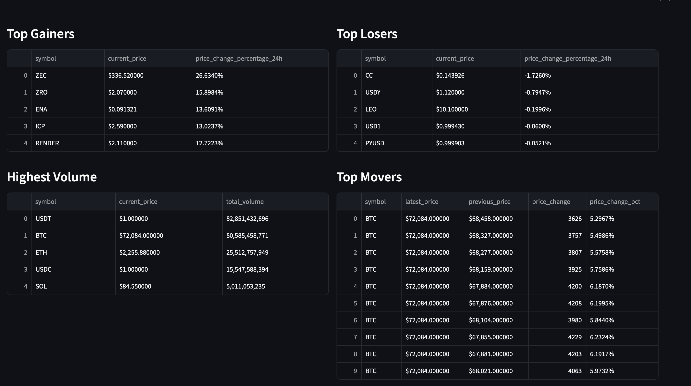

📈 Crypto Analytics Dashboard

A production-ready cryptocurrency data pipeline and analytics dashboard built with Python, MySQL, and Streamlit.

This project collects live market data, stores it in a cloud database, analyzes price movements, and presents insights through an interactive dashboard with alert detection.

⸻⸻⸻⸻⸻⸻

🌐 Live Demo

👉 https://crypto-data-pipeline-production.up.railway.app

⸻⸻⸻⸻⸻⸻

🚀 Features

🔄 Data Pipeline
	•	Fetches real-time crypto data from CoinGecko API
	•	Stores structured data in cloud-hosted MySQL (Railway)
	•	Maintains:
	•	coins
	•	latest_prices
	•	price_history
	•	price_history_archive
	•	Optimized insert logic to prevent duplicates

⸻⸻⸻⸻⸻⸻

⚙️ Automation & Reliability
	•	Fully automated using Railway Cron Jobs
	•	Runs every 15 minutes
	•	Continuous background data collection
	•	Logging system for monitoring pipeline activity
	•	Error tracking via logs

⸻⸻⸻⸻⸻⸻

📊 Analytics Engine
	•	Top gainers / losers
	•	Highest volume coins
	•	Short-term price movements
	•	Historical price tracking
	•	Multi-coin performance comparison

⸻⸻⸻⸻⸻⸻

📊 Dashboard (Streamlit UI)
	•	Cloud-hosted interactive dashboard
	•	Auto-refresh every 2 minutes
	•	Search & filter functionality
	•	Clean formatted tables
	•	Interactive charts
	•	Multi-coin comparison with normalization
⸻⸻⸻⸻⸻⸻

🧠 Advanced Comparison
	•	Compare multiple coins in one chart
	•	Normalized performance (Base = 100)
	•	Best / worst performer detection
	•	Ranked performance summary

⸻⸻⸻⸻⸻⸻

🚨 Alert System

Detects significant market events:
	•	🚀 Strong Increase → 24h price ≥ +5%
	•	🔻 Sharp Drop → 24h price ≤ -5%
	•	⚡ Rapid Movement → short-term price change ≥ 2%

Transforms the dashboard from data display → decision support tool.

⸻⸻⸻⸻⸻⸻

🧱 Architecture

CoinGecko API
→ Python Data Pipeline (Worker Service)
→ MySQL Database (Railway)
→ Analytics Layer
→ Streamlit Dashboard (Web Service)

⸻⸻⸻⸻⸻⸻

🛠 Tech Stack
	•	Python
	•	MySQL
	•	Streamlit
	•	Pandas
	•	Altair
	•	CoinGecko API
	•	Railway (Deployment & Hosting)

⸻⸻⸻⸻⸻⸻

```
📂 Project Structure

crypto-data-pipeline/
├── src/
│   ├── main.py              # Pipeline runner (worker)
│   ├── fetch_data.py        # API data fetching
│   ├── insert_data.py       # DB insert/update logic
│   ├── archive_data.py      # Archiving old records
│   ├── db.py                # Database connection
│   ├── analytics.py         # Analytics & alerts
│   ├── app.py               # Streamlit dashboard
│   └── logger_config.py     # Logging config

├── sql/
│   └── schema.sql           # Database schema

├── assets/                  # Screenshots
├── requirements.txt
├── README.md
└── .gitignore
```

⸻⸻⸻⸻⸻⸻⸻

▶️ How to Run (Local)

1. git clone https://github.com/AlperTuncOrtak/crypto-data-pipeline.git
cd crypto-data-pipeline

2. python3 -m venv .venv
source .venv/bin/activate

3. pip install -r requirements.txt

4. streamlit run src/app.py

⸻⸻⸻⸻⸻⸻⸻

📸 Screenshots

### Alerts System


### Search & Filter


### Multi-Coin Comparison


### Dashboard Overview


⸻⸻⸻⸻⸻⸻⸻

🧠 What This Project Demonstrates
	•	Building an end-to-end data pipeline (API → DB → Dashboard)
	•	Designing efficient database schemas for time-series data
	•	Implementing real-time analytics
	•	Deploying full-stack applications to the cloud
	•	Working with scheduled background jobs (cron)
	•	Creating production-ready dashboards


⸻⸻⸻⸻⸻⸻⸻

🔮 Future Improvements
	•	Discord alert integration
	•	Advanced anomaly detection
	•	User-defined alert thresholds
	•	Export (CSV / reports)
	•	Performance optimization (caching, query tuning)

⸻⸻⸻⸻⸻⸻⸻

👤 Author

Alper Tunc Ortak

⸻⸻⸻⸻⸻⸻⸻

⭐ Notes

This project was built as part of a portfolio to demonstrate real-world data engineering, analytics, and cloud deployment skills.

